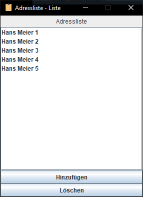
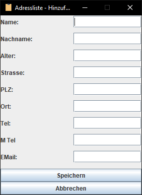
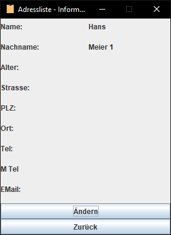

## M120-Adressbuch

### Aufgabe

**Auszug aus der Modulseite**

Im Projekt erfahren Sie einmal den Prozessablauf von der Programmidee bis zur Realisierung.

Sie können Ihre Programmidee mit Grundlagen prüfen.

Sie können Ihre Programmidee mit Java realisieren.

### Features

* Einträge hinzufügen
* Eintrage editieren
* Eintrage löschen
* Einträge betrachten

### Bilder

Listen Ansicht

Hinzufügen Ansicht

Detail Ansicht

